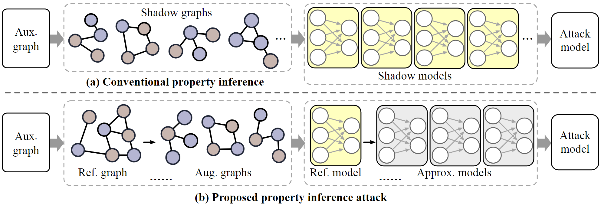
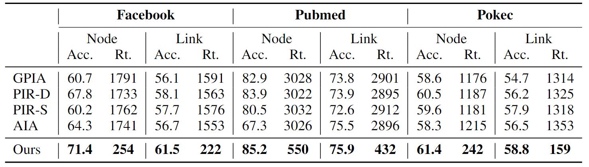
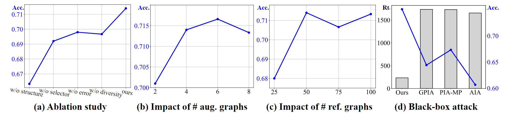

# Towards More Efficient Property Inference Attacks on Graph Neural Networks (NeurIPS'24)

Hanyuan Yuan, <a href='https://galina0217.github.io/'>Jiarong Xu*</a>, Renhong Huang</a>, <a href='https://vipazoo.cn/people/songmingli.html'>Mingli Song</a>, Chunping Wang, and <a href='http://yangy.org/'>Yang Yang</a>. (*Corresponding author)

 <a href='https://neurips.cc/'></a> 
 <a href='https://github.com/horrible-dong/DNRT/blob/main/LICENSE'></a> 

<div align='center'>

</div>


## Brief Introduction

Graph neural networks are widely used, but limitations in graph data availability and quality create challenges for effective training. To address privacy concerns, data owners often train GNNs on private graphs and share only the models. However, these shared models may still leak sensitive information about the training graphs.
This work addresses the risk of sensitive property inference attacks on shared models with three main contributions:
- We propose an efficient graph property inference attack using model approximation techniques, reducing reliance on numerous shadow models.
- We enhance model diversity and minimize errors through a data-centric approach, analyzing error bounds and introducing edit distance as a diversity measure, formulated as an efficient optimization problem.
- Experiments across six real-world scenarios show a 2.7% improvement in attack accuracy, a 5.6% increase in ROC-AUC, and a 6.5x speedup over the best baseline.

For more details, please refer to the paper.


## Table of Contents:

* <a href='#Environment Set-up'>Environment Set-up </a>
* <a href='#Dataset Set-up'>Dataset Set-up </a>
* <a href='#Property inference'>Experiment on graph property inference attack </a>
* <a href='#Main experiment result'>Main experiment result </a>


### Environment Set-up
<span id='Environment Set-up'/></span>

Please first clone the repo and install the required environment, which can be done by running the following commands:

```shell
# Clone our repo
git clone https://github.com/xxx08796/GPIA_NIPS.git
cd GPIA_NIPS
mkdir data
# Create conda env
conda create -n gpia python=3.8.0 -y
conda activate gpia
# Torch 2.0.1 with CUDA 11.8
pip install torch==2.0.1 torchvision==0.15.2 torchaudio==2.0.2 --index-url https://download.pytorch.org/whl/cu118
# Install required libraries
pip install -r requirements.txt
pip install torch-sparse==0.6.17 -f https://pytorch-geometric.com/whl/torch-2.0.1+cu118.html
pip install torch-scatter==2.1.1 -f https://pytorch-geometric.com/whl/torch-2.0.1+cu118.html
```


### Dataset Set-up
<span id='Dataset Set-up'/></span>

We used three datasets in this work, including: **Facebook**, **Pubmed**, and **Pokec**.
You can download the Facebook dataset [here](https://drive.google.com/drive/folders/1Mh2xO_mCVgiINn_b-XzUP2p8BKTqcYaq?usp=drive_link).
And add them to [./data/]() in this project.


### Experiment on graph property inference attack
<span id='Property inference'/><span>

- **Launching an attack:** To run the proposed attack on node property, you could execute [exp_node_property.py](exp_node_property.py). 

```text
python exp_node_property.py \
    --device <GPU ID> \
    --num_shadow <number of selected approximated models> \
    --num_candidate <number of to-be-selected approximated models> \
    --num_train <number of reference graphs> \
    --data <dataset name> \
```

- Below is a demo on **Facebook**, targeting the node property as whether the male nodes are dominant:
```shell
python exp_node_property.py --device 0 --num_shadow 4 --num_candidate 8 --num_train 50 --data facebook
```


### Main experiment result
<span id='Main experiment result'/><span>

- Average accuracy and runtime (seconds) comparison on different properties in white-box setting.
“Node” and “Link” denote node and link properties, respectively. The best results are in bold.

<div align='center'>

</div>

- (a): Evaluation of the necessity of considering diversity while minimizing the approximation error. 
(b) and (c): Impact of the number of augmented graphs (per reference graph) and reference graphs on attack accuracy, respectively. 
(d) Accuracy and runtime comparison in black box setting.

<div align='center'>

</div>

## Contact

For any questions or feedback, feel free to contact [Hanyang Yuan](mailto:yuanhy0408@zju.edu.cn).


## Acknowledgements

This code implementation was inspired by [CEU](https://github.com/kunwu522/certified_edge_unlearning) and [GIF](https://github.com/wujcan/GIF-torch/). 
This readme.md was inspired by [GraphGPT](https://github.com/HKUDS/GraphGPT). Thanks for their wonderful works.
